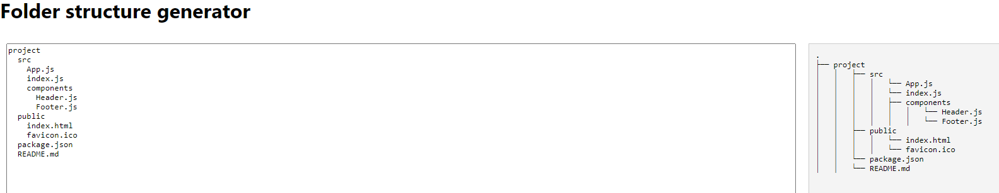

# Folder structure generator

This project provides a web application for visualizing folder structures. Users can input text with spaces or tabs to represent hierarchical folder structures, and the app will render a visual representation of the structure.

## Installation

1. Clone the repository:

    ```bash
    git clone https://github.com/AlpSari/folder-structure-generator.git
    cd folder-structure-generator
    ```

2. Install dependencies:

    ```bash
    npm install
    ```

## Usage

1. Start the development server:

    ```bash
    npm start
    ```

2. Open your browser and navigate to:

    ```plaintext
    http://localhost:3000
    ```

3. Input your folder structure in the text area and see the visual representation on the right. An example output is shown for the following input:

    ```plaintext
    project
    src
        App.js
        index.js
        components
        Header.js
        Footer.js
    public
        index.html
        favicon.ico
    package.json
    README.md
    ```

    

The output tree is can be copied to clipboard by using the "Copy to Clipboard button below".

## License

This project is licensed under the MIT License. See the [LICENSE](LICENSE) file for details.
